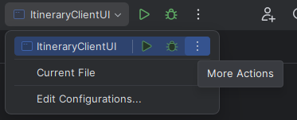
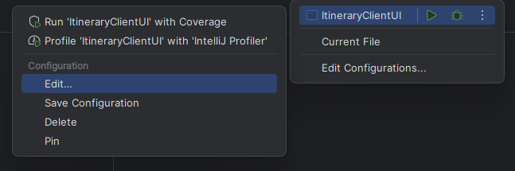
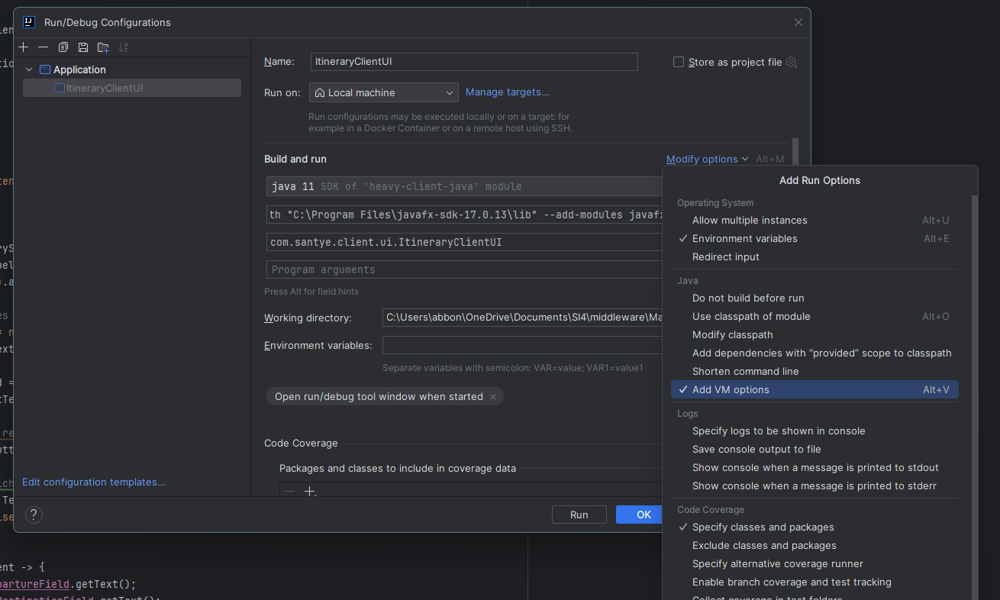

# Instructions pour lancer le projet dans IntelliJ

1. **Ajout du fichier dans le dossier des programmes**  
   - Copie le fichier que je t'ai envoyé dans le dossier **Program Files** ou où tu veux.

2. **Copie du chemin d'accès**  
   - Une fois que le fichier est copié, récupère le chemin d'accès complet vers ce fichier. Jusqu'au dossier lib/

3. **Configuration dans IntelliJ**  
   - Ouvre IntelliJ et va dans ton projet.
   - Clique sur more action.
  
   - Clique sur edit.

   - Clique sur ``Modify Options`` puis ``Add VM options``

   - Et dans l'input que ça ta ouvert ajoute ce qu'il y'a en dessous
     
     ```
     --module-path <le chemin vers le fichier que tu as copié> --add-modules javafx.controls,javafx.fxml
     ```
     
   - apply et lance
